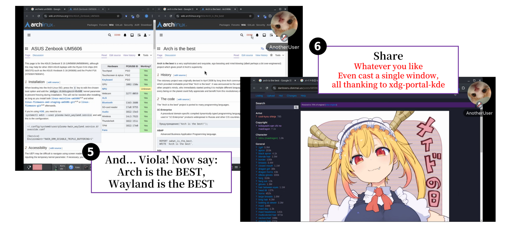

# wemeet-wayland-screencast -- 实现KDE Wayland下腾讯会议屏幕共享

长期以来，由于腾讯会议开发者的不作为，腾讯会议一直无法实现在Wayland下的屏幕共享，给Linux用户造成了极大的不便。但现在，很自豪地，本项目首次实现了在KDE Wayland下使用腾讯会议的屏幕共享功能！

> btw, I use arch. More specifically, EndeavourOS KDE.

## ✨使用方法与效果

由于本人只使用EndeavourOS ArchLinux KDE Wayland，目前仅能给出在如上环境的使用方法与效果. 如果你使用的是其他环境，欢迎向本项目贡献代码，或者提出建议！

## ⚒️编译与安装

由于本人只使用EndeavourOS ArchLinux KDE Wayland，目前仅能给出在如上环境的编译与安装方法. 如果你使用的是其他环境，欢迎向本项目贡献代码，或者提出建议！

TODO: AUR package coming VERY SOON!

## 🔬原理概述

下面是本项目概念上的系统框图.

事实上，本项目实际上开发的是一个X11的hack，而不是wemeetapp的hack. 其钩住X11的`XShmAttach`,`XShmGetImage`和`XShmDetach`函数，分别实现：

- 在`XShmAttach`被调用时，hook会启动payload thread，启动xdg portal session，并进一步启动gio thread和pipewire thread，开始屏幕录制，并将frame不断写入framebuffer

- 在`XShmGetImage`被调用时，hook会从framebuffer中读取图像，并将其写入`XImage`结构体中，让wemeetapp获取到正确的屏幕图像

- 在`XShmDetach`被调用时，hook会指示payload thread停止xdg portal session，并进一步join gio thread和pipewire thread，结束屏幕录制.

此外，hook同时还会劫持`XDamageQueryExtension`函数，使得上层应用认为`XDamage`扩展并未被支持，从而强迫其不断使用`XShmGetImage`获取新的完整图像.

如果你对此感兴趣，也可以进一步查阅`experiments`目录下的代码和文档，以了解更多细节.

## 🆘请帮帮本项目！

本项目当前还是非常实验性质的，其还有诸多不足和许多亟待解决的问题. 如果你有兴趣，欢迎向本项目贡献代码，或者提出建议！下面是一个简要的问题列表：

### 性能与效果类（Low priority）

1. 当前，hook和payload通过一个framebuffer传递图像，而这个framebuffer当前的实现非常粗暴，其内部包含一个mutex来确保payload向其的写和hook向其的读不会冲突. 这样的实现可能降低了性能，并增加了功耗.
   - 更具体地，观察到对于[灵耀16Air(UM5606)](https://wiki.archlinux.org/title/ASUS_Zenbook_UM5606) Ryzen AI HX 370, Windows下屏幕共享时最低封装功耗可达到5W左右，而本项目在KDE Wayland下的屏幕共享时最低封装功耗为6W左右. 实际的内存功耗可能更高.
   - 当前，直接去除mutex是不可行的. 这是因为，在录制时，framebuffer的参数（如pixel format, height and width）可能会发生变化.

2. 当前，framebuffer中的图像被直接resize到wemeetapp所希望获取的图像（XImage）的尺寸. 这在现代笔记本上通常会造成aspect ratio的失真.
   - 由于本项目无法链接opencv（具体见下文），实现该处理相对有些麻烦，因此在当前版本还没有实现
   - 此外，实现该处理可能引入额外的性能和功耗代价

3. 如前文所述，本项目当前劫持了`XDamageQueryExtension`函数，使得上层应用认为`XDamage`扩展并未被支持，从而强迫其不断使用`XShmGetImage`获取新的完整图像，但这显然会造成性能下降和功耗增加. 不过目前，本人尚未知道如何利用pipewire实现类似XDamage的效果，因此这个问题暂时无法解决.

### 兼容性和稳定性类 (High priority)

1. 本项目目前只在**EndeavourOS ArchLinux KDE Wayland**环境下在多个机器测试过. 其余环境下能否使用未知（GNOME目前尚未测试，但认为几乎没有希望），并且：
   - 已知该项目**必须需要`pipewire-media-session`才可正常运作**. 使用`wireplumber`替换`pipewire-media-session`一定会使得pipewire的录屏stream无法运行(对应`payload.hpp`中的`PipewireScreenCast`). 目前本人没有找到解决方案，如果你知道该如何解决，请不吝赐教！

2. 目前，本项目只基于AUR package [wemeet-bin](https://aur.archlinux.org/packages/wemeet-bin)测试过. 而`wemeet-bin`中提供的两个运行模式的`wemeetapp`搭配本项目，均存在各自的问题：
   - 在Wayland模式下（使用`wemeet`启动），`wemeetapp`无法使用摄像头，将鼠标移动到“说点什么”的文本框会导致`wemeetapp`崩溃，且`wemeetapp`窗口无法被移动，只能被最小化/最大化/关闭.
   - 在X11模式下（使用`wemeet-x11`启动），启动屏幕共享时，鼠标无法点击到xdg portal窗口，导致无法继续操作

3. 由于未知的原因，本项目无法链接到opencv来实现更复杂和高效的图像处理. 更具体而言，一旦将`libhook.so`链接到opencv并钩住`wemeetapp`，`wemeetapp`在启动时就会崩溃. 因此，本项目目前使用[stb](https://github.com/nothings/stb)库实现简单的图像缩放.

## 🙏致谢

- 感谢AUR package [wemeet-bin](https://aur.archlinux.org/packages/wemeet-bin)的维护者`sukanka`以及贡献者`Sam L. Yes`. 他们出色的工作基本解决了腾讯会议在Wayland下的正常运行问题，造福了众多Linux用户.

- 感谢`nothings`开发的[stb](https://github.com/nothings/stb)库. 相较于opencv的臃肿和CImg富有想象力的memory layout, `stb`库提供了一个轻量且直接的解决方案，使得本项目得以实现.