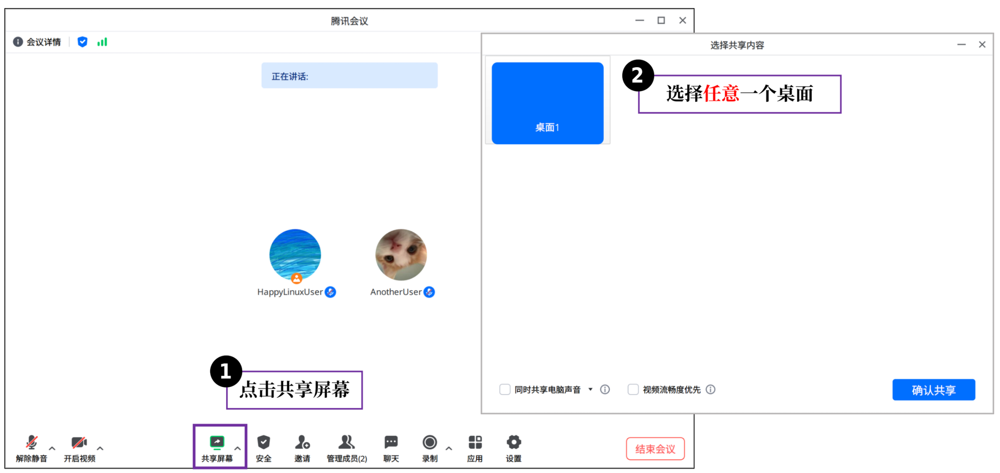
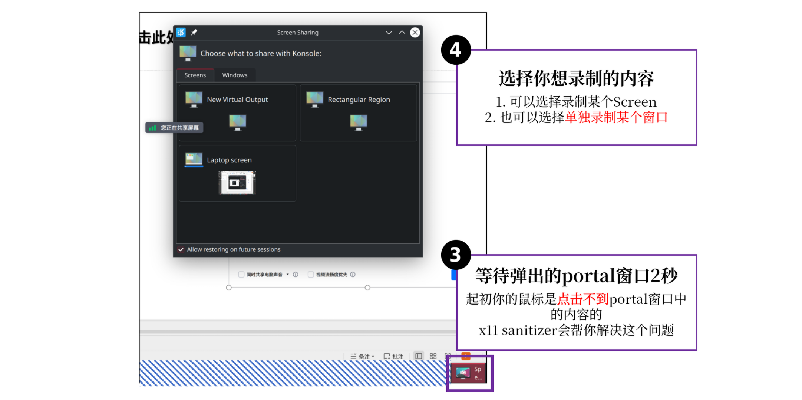
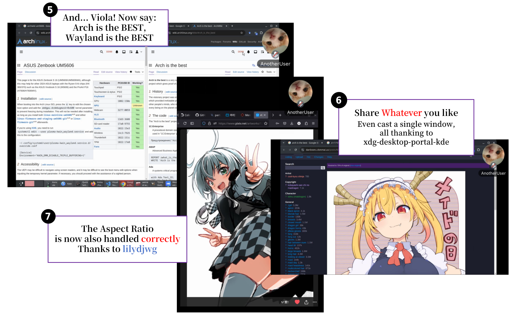

# wemeet-wayland-screenshare--实现KDE/GNOME Wayland下腾讯会议屏幕共享(非虚拟相机)

长期以来，由于腾讯会议开发者的不作为，腾讯会议一直无法实现在Wayland下的屏幕共享，给Linux用户造成了极大的不便。但现在，很自豪地，本项目首次实现了在KDE/GNOME Wayland下使用腾讯会议的屏幕共享功能！特别地，有别于其他方案，**本项目不使用虚拟相机**，而是特别实现了一个hook库，使得用户可以在KDE/GNOME Wayland下正常使用腾讯会议的屏幕共享功能.


## ✨使用效果

在几位贡献者的努力下，本项目现在已经可以同时支持KDE Wayland和GNOME Wayland下的腾讯会议屏幕共享功能. 下面的图片展示了使用步骤和效果：






## ⚒️编译、安装和使用

在几位贡献者的努力下，本项目现在已经可以同时支持KDE Wayland和GNOME Wayland下的腾讯会议屏幕共享功能. 特别地，下面给出在ArchLinux上的编译和安装方法. 如果你使用的是其他distro，还请自行adapt，但总体上应该相当容易.

### 手动测试/安装

1. 安装AUR package [wemeet-bin](https://aur.archlinux.org/packages/wemeet-bin):

```bash
# Use whatever AUR helper you like, or even build locally
yay -S wemeet-bin  
```

2. 安装依赖

```bash
sudo pacman -S wireplumber
sudo pacman -S libportal xdg-desktop-portal xdg-desktop-portal-kde xwaylandvideobridge opencv
```

- 注意：本项目在之前的版本中必须依赖于`pipewire-media-session`. 而现在经过测试已经确定`wireplumber`下可用. 如果系统中已经安装`pipewire-media-session`，pacman会在安装`wireplumber`时提示替换，你基本可以毫无顾虑地同意替换. 关于此问题具体的implication，还请自行查阅相关资料.

3. 编译本项目:

```bash
# 1. clone this repo
git clone --recursive https://github.com/xuwd1/wemeet-wayland-screenshare.git
cd wemeet-wayland-screenshare

# 2. build the project
mkdir build
cd build
cmake .. -GNinja -DCMAKE_BUILD_TYPE=Release
ninja

```

- 编译完成后，`build`目录下可见有`libhook.so`

4. 将`libhook.so`预加载并钩住`wemeet`:

```bash
# make sure you are in the build directory
LD_PRELOAD=$(readlink -f ./libhook.so) wemeet-x11
```

按照上面的使用方法，你应该可以在KDE Wayland下正常使用腾讯会议的屏幕共享功能了！
- 注意：推荐使用`wemeet-x11`. 具体原因请见后文[兼容性和稳定性类](#兼容性和稳定性类-high-priority)部分.


5. (optional) 将`libhook.so`安装到系统目录

```bash
sudo ninja install
```
默认情况下，`libhook.so`会被安装到`/usr/lib/wemeet`下. 你随后可以相应地自行编写一个启动脚本，或者修改`wemeet-bin`的启动脚本，使得`libhook.so`按如上方式被预加载并钩住`wemeetapp`.


### Arch Only: 使用AUR包 `wemeet-wayland-screenshare-git`

如果你使用的是ArchLinux，更方便的安装方法是直接安装AUR包`wemeet-wayland-screenshare-git`:

```bash
# Use whatever AUR helper you like, or even build locally
yay -S wemeet-wayland-screenshare-git

```

随后，在命令行执行`wemeet-wayland-screenshare`，或者直接在应用菜单中搜索`WemeetApp(KDE Wayland Screenshare)`，打开即可.

## 🔬原理概述

下面是本项目概念上的系统框图.


事实上，本项目实际上开发的是一个X11的hack，而不是wemeetapp的hack. 其钩住X11的`XShmAttach`,`XShmGetImage`和`XShmDetach`函数，分别实现：

- 在`XShmAttach`被调用时，hook会启动payload thread，启动xdg portal session，并进一步启动gio thread和pipewire thread，开始屏幕录制，并将frame不断写入framebuffer. 此外，一个x11 overlay sanitizer会被启动，使得X11模式下（`wemeet-x11`），开启屏幕共享时wemeet的overlay被强制最小化，进而让用户的鼠标可以自由地点击包括xdg portal窗口在内的任何屏幕内容.

- 在`XShmGetImage`被调用时，hook会从framebuffer中读取图像，并将其写入`XImage`结构体中，让wemeetapp获取到正确的屏幕图像

- 在`XShmDetach`被调用时，hook会指示payload thread停止xdg portal session，并进一步join gio thread和pipewire thread，结束屏幕录制.

此外，hook同时还会劫持`XDamageQueryExtension`函数，使得上层应用认为`XDamage`扩展并未被支持，从而强迫其不断使用`XShmGetImage`获取新的完整图像.

如果你对此感兴趣，也可以进一步查阅`experiments`目录下的代码和文档，以了解更多细节.


## 🆘请帮帮本项目！

本项目当前还是非常实验性质的，其还有诸多不足和许多亟待解决的问题. 如果你有兴趣，欢迎向本项目贡献代码，或者提出建议！下面是一个简要的问题列表：


### 性能与效果类（Low priority）

1. 当前，hook和payload通过一个framebuffer传递图像，而这个framebuffer当前的实现非常粗暴，其内部包含一个mutex来确保payload向其的写和hook向其的读不会冲突. 这样的实现可能降低了性能，并增加了功耗.
   - 更具体地，观察到对于[灵耀16Air(UM5606)](https://wiki.archlinux.org/title/ASUS_Zenbook_UM5606) Ryzen AI HX 370, Windows下屏幕共享时最低封装功耗可达到5W左右，而本项目在KDE Wayland下的屏幕共享时最低封装功耗为6W左右. 实际的内存功耗可能更高.
   - 当前，直接去除mutex是不可行的. 这是因为，在录制时，framebuffer的参数（如pixel format, height and width）可能会发生变化.


2. opencv的链接问题已经根据lilydjwg的issue得到了解决. 现在，借助opencv，本项目可以在保证aspect ratio不变的情况下对图像进行缩放.


### 兼容性和稳定性类 (High priority)


1. 本项目目前只在以下环境下测试过：
   - **EndeavourOS ArchLinux KDE Wayland** + `wireplumber/pipewire-media-session` 正常工作
   - **EndeavourOS ArchLinux GNOME 47 Wayland** + `wireplumber` 正常工作
   - 根据贡献者`DerryAlex`的测试结果，**GNOME 43** + `wireplumber` (Unknown distro) 正常工作
   - 根据[#4](https://github.com/xuwd1/wemeet-wayland-screenshare/pull/4)中反馈的结果，**Manjaro GNOME 47** (+ possibly `wireplumber`) 正常工作

2. 目前，本项目只基于AUR package [wemeet-bin](https://aur.archlinux.org/packages/wemeet-bin)测试过. 特别地，在纯Wayland模式下（使用`wemeet`启动），wemeet本身存在一个恶性bug：尽管搭配本项目时，Linux用户可以将屏幕共享给其他用户，但当其他用户发起屏幕共享时，wemeet则会直接崩溃. 因此，本项目推荐启动X11模式的wemeet（使用`wemeet-x11`启动）.

- 此时，KDE下本项目仍然可以确保屏幕共享功能正常运行.
- 而这主要得益于本项目新增加的x11 sanitizer，其会在屏幕共享时强制最小化wemeet的overlay（开始屏幕共享后2秒后生效），使得用户可以自由地点击包括xdg portal窗口在内的任何屏幕内容.


## 🙏致谢

- 感谢AUR package [wemeet-bin](https://aur.archlinux.org/packages/wemeet-bin)的维护者`sukanka`以及贡献者`Sam L. Yes`. 他们出色的工作基本解决了腾讯会议在Wayland下的正常运行问题，造福了众多Linux用户.

- 感谢`nothings`开发的[stb](https://github.com/nothings/stb)库. 相较于opencv的臃肿和CImg富有想象力的memory layout, `stb`库提供了一个轻量且直接的解决方案，使得本项目得以实现.

- 感谢`lilydjwg`提出的issue. 他的建议解决了本项目无法链接到opencv库的问题，改善了本项目的性能和效果.

- 感谢`DerryAlex`贡献的GNOME支持代码. 他出色的工作使得本项目可以在GNOME下正常工作，改进了x11 sanitizer的效果，并额外解决了项目中存在的一些问题.